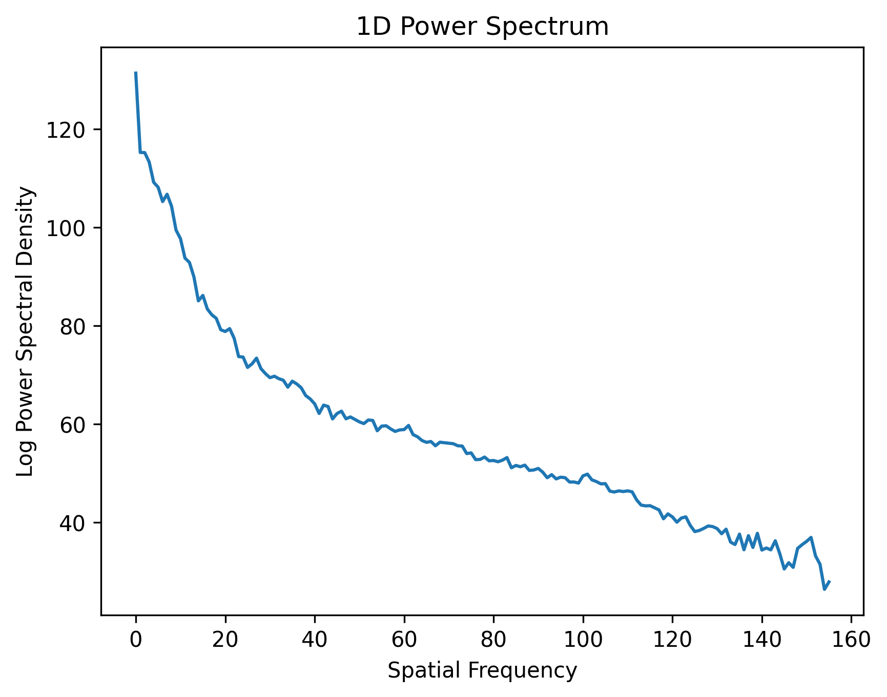

Spectral Profile
============

This little script can be easily used on your PyTorch project to visualize 
the spectral profile of a generated (or any) image (either 2D or 3D).

The program is an unofficial PyTorch implementation of 
[UpConv](https://github.com/cc-hpc-itwm/UpConv) which is originally written using Numpy.
In addition to the original implementation, this program can also be used on 3D images, 
e.g. MRI or CT volumes.

Also see [frequency_bias](https://github.com/autonomousvision/frequency_bias) which is another 
PyTorch implementation but with only 2D-support and with obsolete PyTorch syntax.

Dependencies
------------
* PyTorch
* PIL (only for the example data)
* Numpy (only for the example data)
* Matplotlib
* Nibabel (optional, only for loading NiFTI files)

Usage
-----
To get the spectral profile of an image loaded as a tensor `img`, 
simply call the function `get_spectrum` as follows:

    psd1D = get_spectrum(img)

which returns a 1D power spectral density (PSD) of the image.

Example
-------

Given this following cute cat picture, we first convert it to grayscale, then to a PyTorch tensor.
Finally, we apply `get_spectrum` to get the 1D PSD of the image and plot the PSD using `matplotlib.pyplot`.

```Python
import torch
import numpy as np
from PIL import Image
import matplotlib.pyplot as plt
from SpectralProfile import get_spectrum

# Read image, convert to grayscale, then to PyTorch tensor
img = Image.open("./cat.jpg").convert('L')
arr = np.array(img.getdata(), dtype=np.float32)
arr = arr.reshape(img.size[1], img.size[0])
arr = arr / 255.0
arr = torch.tensor(arr)

# Get 1D PSD of the image
psd1D = get_spectrum(arr)

# Plot the PSD
plt.plot(psd1D)
plt.xlabel('Spatial Frequency')
plt.ylabel('Log Power Spectral Density')
plt.title('1D Power Spectrum')
plt.savefig('./psd1D.png', dpi=300, bbox_inches='tight')
plt.show()
```

 

Let's say you want to look at the power spectrum of a NiFTI file. 
You can use [NiBabel](https://nipy.org/nibabel/) to load the file and convert it to a PyTorch tensor.
Here is an example:

```Python
import torch
import numpy as np
from PIL import Image
import matplotlib.pyplot as plt
from SpectralProfile import get_spectrum
import nibabel as nib

# Read NiFTI file and convert to PyTorch tensor
img = nib.load('./example.nii.gz')
arr = img.get_fdata()
arr = torch.tensor(arr).float()
arr = arr.squeeze()

# Get 1D PSD of the image
psd1D = get_spectrum(arr)

# Plot the PSD
plt.plot(psd1D)
plt.xlabel('Spatial Frequency')
plt.ylabel('Log Power Spectral Density')
plt.title('1D Power Spectrum')
plt.savefig('./psd1D.png', dpi=300, bbox_inches='tight')
plt.show()
```


